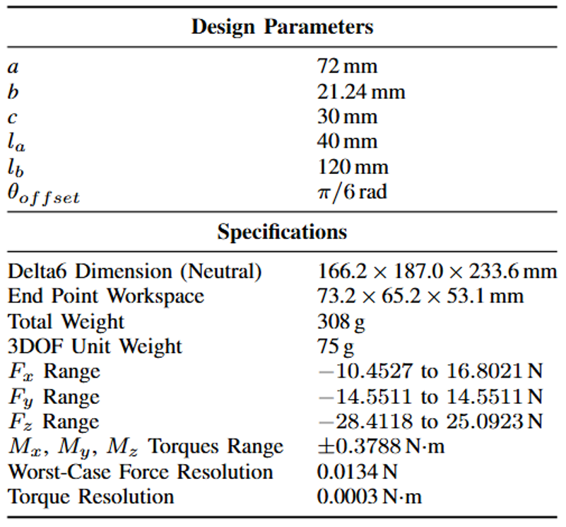

# Delta6: 6-DOF Force-Sensing Flexible End-Effector

  

---

## 🚀 Overview

**Delta6** is a **low-cost**, **lightweight**, and **easy-to-assemble** 6-degree-of-freedom (6-DOF) flexible end-effector. Built upon an innovative modified Delta parallel mechanism, it integrates:

- **Six antagonistic spring units** for high-resolution force sensing.
- Real-time multi-axis force and displacement measurements.
- Built-in analytical compensation algorithms, correcting for imperfections from **3D-printed parts** and **commercial springs**.

Its inherent compliance makes Delta6 ideal for interactive tasks such as human–robot collaboration, precision assembly, and delicate manipulation.

---

## 📐 Specifications

  

- **Compact & Lightweight:** ~170 × 190 × 235 mm, < 310 grams.
- **Operational Workspace:** Tens of millimeters range in all directions.
- **Force & Torque:** ±15 N forces, ±0.4 N·m torques.
- **High Precision:** Resolution down to hundredths of a newton and thousandths of a newton-meter.

---

## 📋 Bill of Materials

| Component                               | Quantity | Unit Cost (USD) | Subtotal (USD) |
|-----------------------------------------|:--------:|:---------------:|---------------:|
| PLA Filament (200 g)                    | 1        | 3.00            | **3.00**       |
| Arduino Nano Every                      | 1        | 13.00           | **13.00**      |
| M2 Tie-Rod Ball Ends                    | 12       | 1.00            | **12.00**      |
| M2 × 100 mm Threaded Rods               | 6        | 2.00            | **12.00**      |
| Mn-Steel Door Handle Springs            | 12       | 2.00            | **24.00**      |
| ERCK-05 SPI 14-bit Magnetic Encoders    | 6        | 43.00           | **258.00**     |
| 15 × 21 × 4 mm Ball Bearing             | 1        | 1.00            | **1.00**       |
| 8 × 12 × 3.5 mm Ball Bearings           | 10       | 1.00            | **10.00**      |
| Wires, Connectors & Fasteners           | Various  | 1.00            | **1.00**       |
| **Total Cost**                          |          |                 | **US $334.00** |

---

## 🔓 Open-Source Highlights

### 🧠 Analytical Force Estimation
Effortlessly translate encoder readings into a **complete 6-DOF wrench**, requiring simple calibration and enabling high-frequency computation on standard microcontrollers or PCs.

### ⚙️ Modular & 3D-Printable
Engineered specifically for **consumer-grade PLA printers**, Delta6 features only **13 unique, symmetrically-arranged parts**, simplifying both manufacturing and assembly.

### 💰 Cost-Effective
Prototype costs are approximately **$300 USD**, with further reductions achievable through bulk production and custom PCB integration.

---

## 🚧 Getting Started

Detailed purchase links, comprehensive CAD models, intuitive assembly instructions, firmware, and a Python SDK are available in DOC website. Start building your Delta6 today and explore the possibilities of affordable, precise robotic interaction!

---
